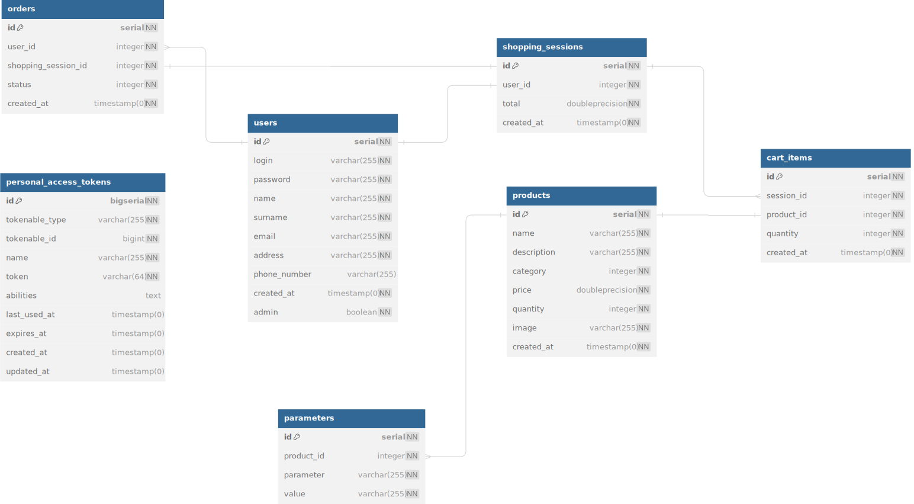

# Projekt z predmetu WTECH 
- [Projekt z predmetu WTECH](#projekt-z-predmetu-wtech)
  - [Téma zadania - všoebecný zámer](#téma-zadania---všoebecný-zámer)
    - [Technologický predpoklad](#technologický-predpoklad)
  - [Dizajn - figma TODO tracker](#dizajn---figma-todo-tracker)
    - [Skice extra large](#skice-extra-large)
    - [Responzivné šablóny](#responzivné-šablóny)
    - [UML class diagram dátového modelu](#uml-class-diagram-dátového-modelu)
  - [Databázová štruktúra](#databázová-štruktúra)
  - [Implementácia](#implementácia)
    - [Autorizácia](#autorizácia)
- [Raw html](#raw-html)
  - [Rozdelenie](#rozdelenie)

## Téma zadania - všoebecný zámer
Vzájomnou dohodou sme došli k finálnej téme, budeme vytvárať stránku, ktorá bude simulovať e-shop v oblasti predaja elektroniky, presnejšie sa budeme venovať mobilným telefónom. 

Nižšie pod špecifikáciou témy sú technologické predpoklad vyobrazené v jednoduchom prehľade, detailnejšie sa venujem jednotlivým postupom, konfiguráciám a implementáciám v praktickej časti aplikovania softvérového riešenia.

### Technologický predpoklad
- Frontend styling - **Tailwind**
- Backend - **Laravel**
- Docker (Databáza) - **Docker Postgres**

## Dizajn - figma TODO tracker
- [x] Navigačné menu
  - [x] Search bar
- [x] Homepage
- [x] Obchodná časť
  - [x] Kategórie (katalóg)
  - [x] List (page)
  - [x] Single (page) 
- [x] Košík
  - [x] Produkty
  - [x] Doprava
  - [x] Platba
  - [x] Dokončenie
- [x] Regristračný form
- [x] Prihlasovací form
- [x] Použitaľské rozhranie
  - [x] Zákazník
  - [x] Admin

### Skice extra large
V tejto časti by sme si radi zadefinovali všeobecnú štruktúru dizajnu, teda jednotnotný postup, ktorý bude dodržovaný pri dizajnovaní stránky. Používame softvér Figma, kde sme si vytvorili zdieľaný projekt, následne si vytvoríme všeobecnú stránku s elementami a tie budeme používať pri tvorbe celého dizajnu.

- tlačidlá
- navbar
- searchbar

Farebná paleta: https://colors.muz.li/palette/e0f0ea/95adbe/574f7d/503a65/3c2a4d

### Responzivné šablóny

### UML class diagram dátového modelu
Na vytváranie fyzického modelu používame stránku [dbdiagram](https://dbdiagram.io/d)

## Databázová štruktúra
Na vytvorenie testovaích dát do databázy používame Faker library.

## Implementácia

### Autorizácia
Laravel Sanctum

# Raw html
## Rozdelenie
- admin-prduct-detail -> Patrik
- admin -> Patrik
- profile -> Patrik
- create_order -> Filip
- index -> Filip
- login -> Patrik
- registration -> Patrik 
- shop -> Patrik ✅
- shopping-cart -> Filip
- single-page -> Filip
- footer -> Patrik
- header -> Patrik